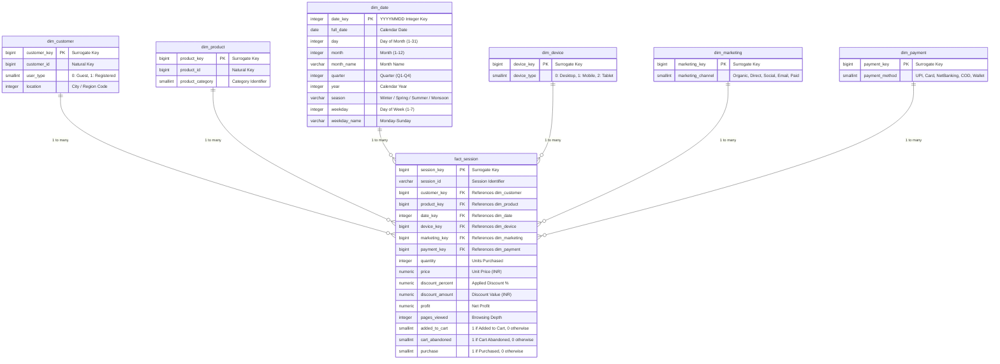
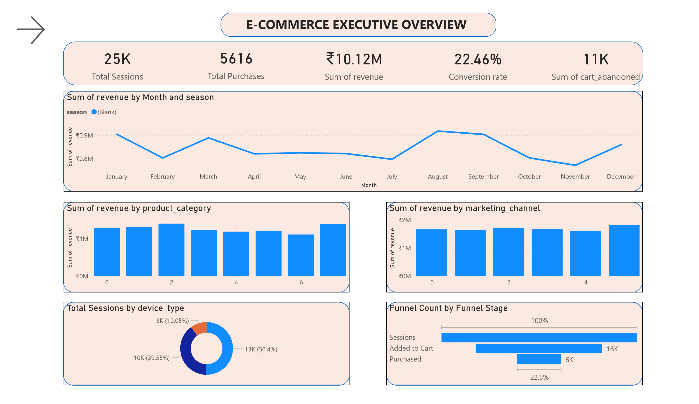
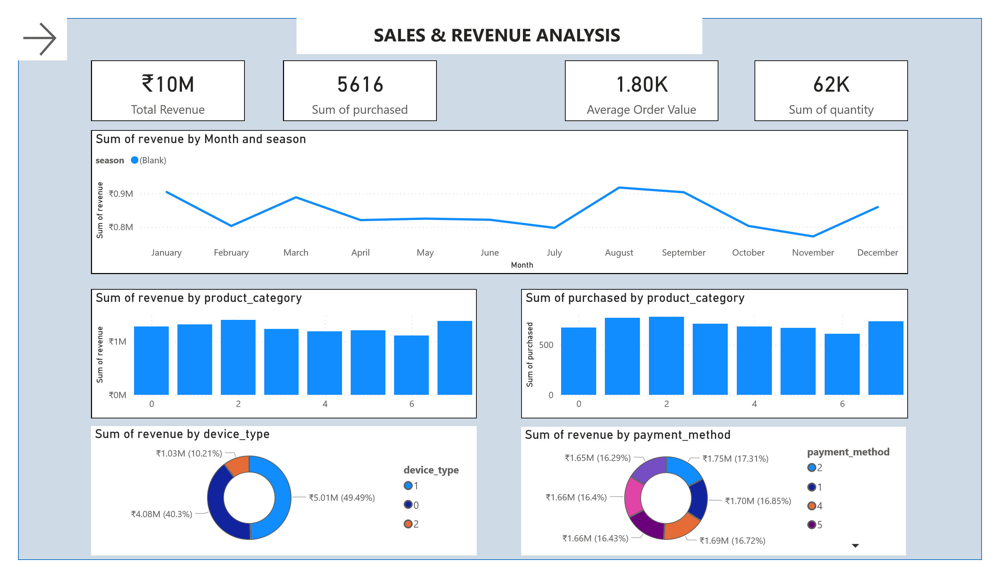
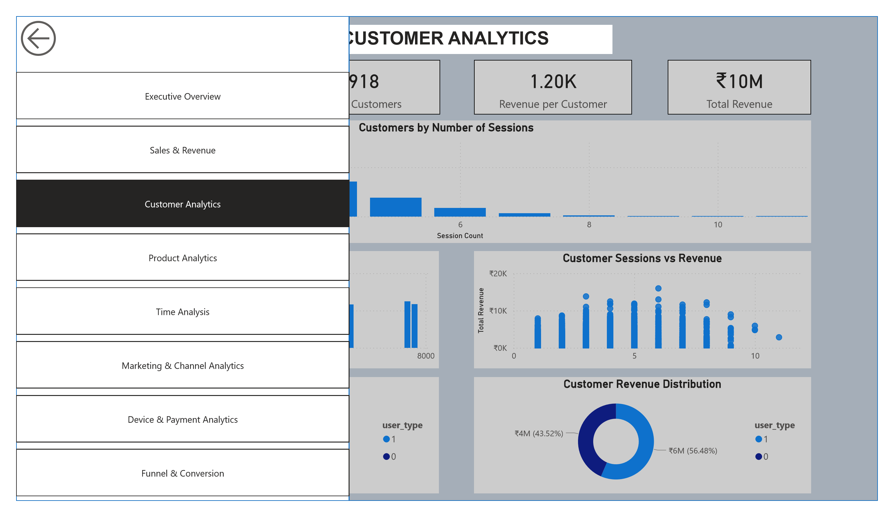
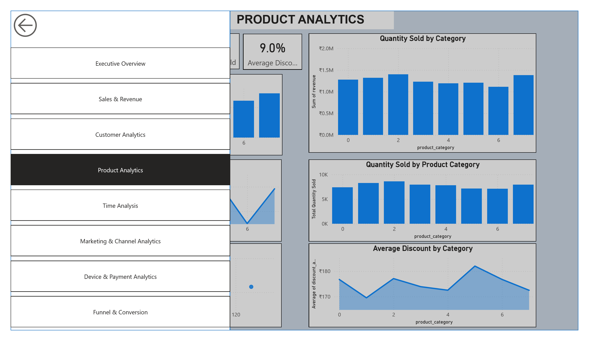
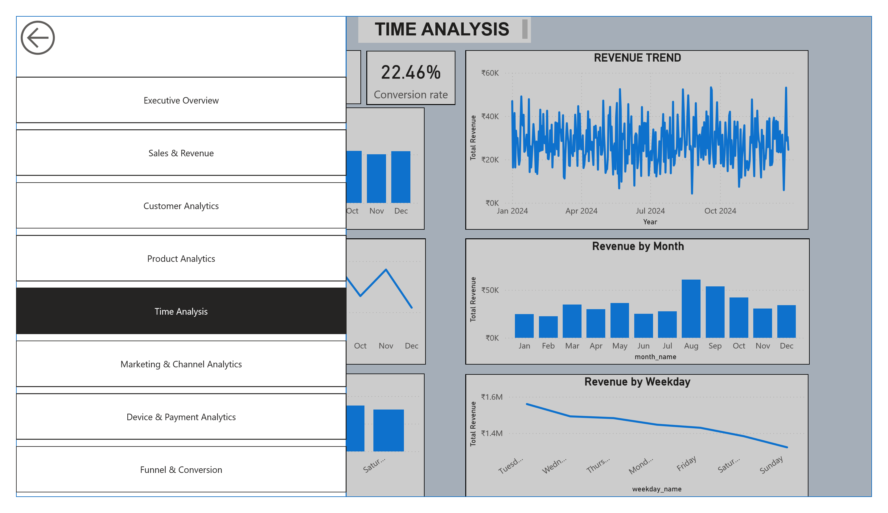
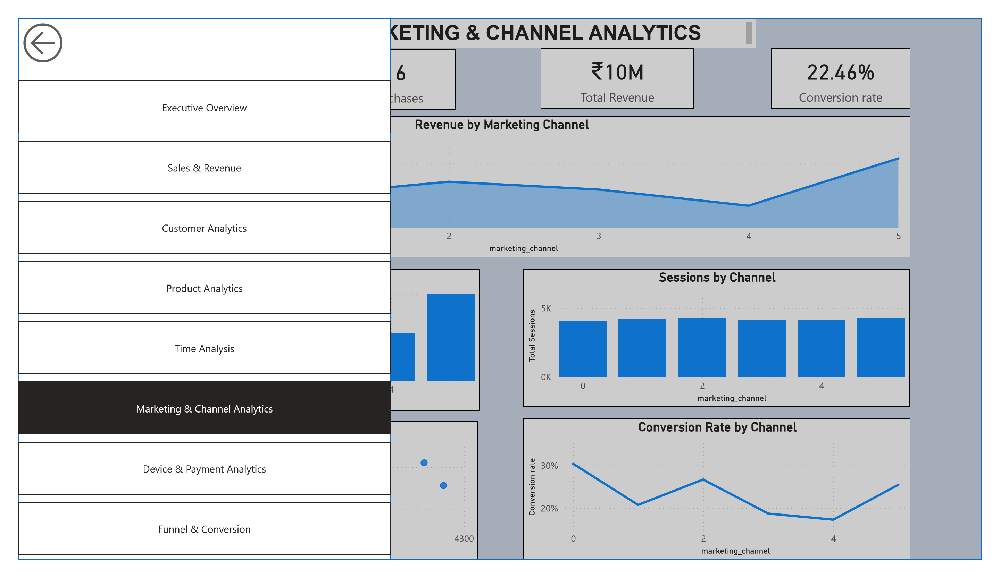
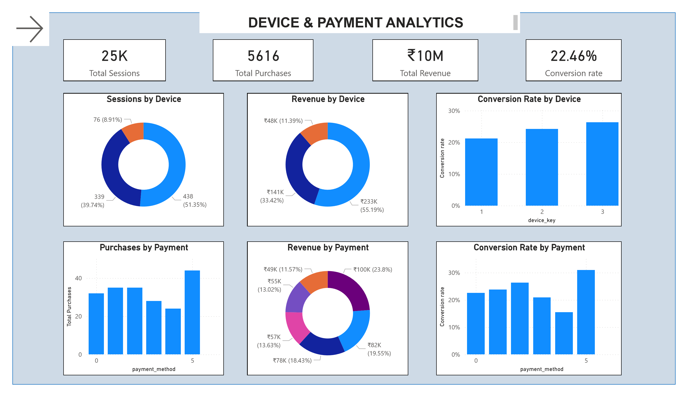
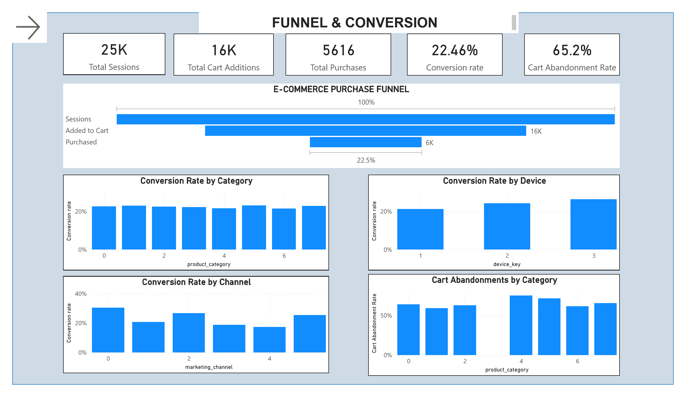

# 🛒 Indian E-Commerce End-to-End Data Engineering & BI Analytics Platform

[](https://spark.apache.org/)
[](https://www.postgresql.org/)
[](https://powerbi.microsoft.com/)
[](https://www.python.org/)

An enterprise-grade **Medallion Architecture (Bronze ➔ Silver ➔ Gold)** Data Engineering and Business Intelligence pipeline built with **Apache PySpark**, **PostgreSQL Data Warehouse**, and an **8-Page Interactive Power BI Dashboard**.

---

## 📊 Dataset Reference

- **Source**: [Kaggle - Indian E-Commerce Customer Behavior and Purchase Dataset](https://www.kaggle.com/datasets/kundanbedmutha/indian-e-commerce-customer-behavior-and-purchase)
- **Description**: Captures user browsing sessions, customer demographics, marketing channel interactions, cart additions, payment types, purchase quantities, discounts, and customer churn metrics across the Indian e-commerce landscape.

---

## 📌 Architecture & Data Flow

```
Raw Kaggle CSV (data/raw/Ecommerce.csv)
                  │
                  ▼
         [ 🥉 Bronze Layer ]       ➔ Raw PySpark Ingestion (Immutably stored as Parquet)
                  │
                  ▼
         [ 🥈 Silver Layer ]       ➔ Data cleansing, schema standardization & normalization
                  │                  into 7 relational entities (customers, products, sessions, etc.)
                  │
                  ▼
         [ 🥇 Gold Layer ]         ➔ Star Schema Dimensional Model (6 Dimension tables + Fact table)
                  │                  with window-generated surrogate keys
                  │
                  ▼
      [ 🗄️ PostgreSQL DW ]         ➔ Bulk loaded via PySpark JDBC driver to relational `gold` schema
                  │
                  ▼
     [ 📊 Power BI Analytics ]     ➔ 8-Page Interactive BI Dashboard (ecommerce.pbit & ecommerce.pdf)
```

---

## 🏛️ Data Warehouse Star Schema & ER Diagram

The Gold Layer is structured as a high-performance **Star Schema (1 Fact Table + 6 Dimension Tables)** connected through 1-to-many (`1:*`) relationships:



### 📋 Schema Table Reference

| Table Name | Type | Primary / Foreign Key | Description |
| :--- | :--- | :--- | :--- |
| `gold.fact_session` | **Fact** | `session_key` (PK), 6 FKs | Core transaction & session metrics (revenue, cart abandonment, quantity, profit) |
| `gold.dim_customer` | **Dimension** | `customer_key` (PK) | Customer profile, registration tier, and location details |
| `gold.dim_product` | **Dimension** | `product_key` (PK) | Product master and category classifications |
| `gold.dim_date` | **Dimension** | `date_key` (PK) | Date calendar dimensions, seasons, quarters, and day names |
| `gold.dim_device` | **Dimension** | `device_key` (PK) | Browsing device type (Mobile, Desktop, Tablet) |
| `gold.dim_marketing`| **Dimension** | `marketing_key` (PK) | Acquisition channels (SEO, Direct, Paid Ads, Social) |
| `gold.dim_payment` | **Dimension** | `payment_key` (PK) | Payment gateways & transaction methods (UPI, Cards, COD) |

---

## 📈 Power BI Business Intelligence Report

The repository includes a pre-built Power BI report template ([`ecommerce.pbit`](ecommerce.pbit)) and an exported PDF report ([`ecommerce.pdf`](ecommerce.pdf)) covering **8 strategic analytics dashboards**:

### 🎯 Key Performance Indicators (KPIs)
| KPI Metric | Value | Business Impact |
| :--- | :--- | :--- |
| **Total Revenue** | **₹10.12M** | Net sales volume generated |
| **Total Sessions** | **25,000** | High traffic volume across mobile, desktop & tablet |
| **Total Purchases** | **5,616** | Completed transactions |
| **Overall Conversion Rate** | **22.46%** | Session-to-purchase efficiency |
| **Average Order Value (AOV)** | **₹1,800** | Basket size spending efficiency |
| **Total Quantity Sold** | **62,000+** | Product units fulfilled |
| **Cart Abandonment Rate** | **65.20%** | Identified opportunity for re-targeting campaigns |
| **Repeat Customer Base** | **6,918 (81.9%)** | Strong retention and customer loyalty |

---

### 📑 Visual Dashboard Showcase

#### 1. 📊 Executive Overview

- **High-Level KPIs**: ₹10.12M Total Revenue, 25K Sessions, 5,616 Total Purchases, 22.46% Conversion Rate.
- **Key Insights**: Monthly revenue pacing (peaking in August–September), category-level revenue splits, marketing channel contribution, and device session distribution (Mobile 50.4%, Desktop 39.55%, Tablet 10.05%).

---

#### 2. 💰 Sales & Revenue Analysis

- **Metrics**: Average Order Value (AOV) of ₹1.80K with 62,000+ total product units sold.
- **Key Insights**: Revenue and volume breakdown by product category, revenue contribution by device type, and balanced payment method distribution.

---

#### 3. 👥 Customer Analytics & Retention

- **Metrics**: 8,442 Total Customers, 6,918 Repeat Customers (**81.9% retention**), ₹1.20K Average Revenue per Customer.
- **Key Insights**: Session count distribution per user, Top revenue-generating customers, and Registered vs. Guest customer spending split (56.48% vs. 43.52%).

---

#### 4. 📦 Product & Category Analytics

- **Metrics**: 9.0% Average Applied Discount across categories with conversion rates stable between 22%–23%.
- **Key Insights**: Unit sales volume and revenue generation per product category, category-level discount intensity, and revenue vs. quantity correlation.

---

#### 5. 📅 Time & Trend Analysis

- **Metrics**: Complete revenue and conversion velocity across Jan–Dec 2024.
- **Key Insights**: Day-level transaction tracking, weekday seasonality indicating peak sales velocity on Tuesdays & Wednesdays, and monthly conversion trends.

---

#### 6. 📢 Marketing & Acquisition Channel Analytics

- **Metrics**: Traffic attribution across Direct, Organic Search, Social Media, Paid Ads, and Email.
- **Key Insights**: Total revenue by channel, session volume vs. yield efficiency, and channel-wise conversion rate benchmarks (peaking up to 30%+).

---

#### 7. 📱 Device & Payment Gateway Analytics

- **Metrics**: Mobile commerce dominance generating ~55.2% of total platform revenue.
- **Key Insights**: Device conversion comparison (Tablet conversion 26%, Mobile 24%, Desktop 21%), and customer payment gateway distribution (UPI, Cards, NetBanking, COD).

---

#### 8. 🎯 Purchase Funnel & Cart Abandonment

- **Metrics**: Multi-stage conversion funnel and 65.2% Cart Abandonment Rate.
- **Key Insights**: Stage-by-stage drop-off (25K Sessions ➔ 16K Added to Cart [64%] ➔ 5.6K Purchases [22.46%]), and category-specific cart abandonment rates for retargeting optimization.

---

## 📂 Project Structure

```bash
Ecommerce-Data-Engineering/
│
├── data/
│   └── raw/                       # Raw dataset from Kaggle (Ecommerce.csv)
│
├── images/                        # High-resolution Power BI dashboard exports
│   ├── 01_executive_overview.png
│   ├── 02_sales_revenue.png
│   ├── 03_customer_analytics.png
│   ├── 04_product_analytics.png
│   ├── 05_time_analysis.png
│   ├── 06_marketing_channel_analytics.png
│   ├── 07_device_payment_analytics.png
│   └── 08_funnel_conversion.png
│
├── scripts/
│   ├── ingest_bronze.py           # Ingests raw CSV into immutable Bronze Parquet
│   ├── read_bronze.py             # Verifies & inspects Bronze layer
│   ├── profile_data.py            # Summary statistics and exploratory data profiling
│   ├── check_categories.py        # Categorical cardinality and value validation
│   ├── transform_silver.py        # Normalizes & cleans data into Silver entities
│   ├── build_gold.py              # Builds Star Schema (dim_* surrogate keys & fact_session)
│   ├── load_gold_postgres.py      # Distributed batch loader into PostgreSQL via JDBC
│   └── export_pdf_pages.ps1       # Script to export Power BI PDF pages to high-res PNGs
│
├── bronze/                        # Bronze Parquet storage
├── silver/                        # Silver normalized tables (customers, dates, products, etc.)
├── gold/                          # Gold Star Schema Parquet tables
│
├── ecommerce_dw.sql               # PostgreSQL DDL Schema and Analytical SQL queries
├── ecommerce.pbit                 # Power BI Template connecting to PostgreSQL
├── ecommerce.pdf                  # Full 8-page Power BI Dashboard Report export
├── requirements.txt               # Python package dependencies
├── .gitignore                     # Git rules for virtual environments & temporary files
└── README.md                      # Complete project documentation
```

---

## 🌟 Medallion Architecture Breakdown

### 🥉 Bronze Layer (`scripts/ingest_bronze.py`)
- Ingests raw CSV without schema mutation.
- Stores dataset in snappy-compressed **Parquet** format.
- Guarantees replayability and data lineage.

### 🥈 Silver Layer (`scripts/transform_silver.py`)
- Standardizes schema to `snake_case`.
- Removes duplicates, handles null values, and enforces data types.
- Splits the flat dataset into 7 relational entities:
  - `customers`
  - `products`
  - `dates`
  - `devices`
  - `marketing`
  - `payments`
  - `sessions`

### 🥇 Gold Layer (`scripts/build_gold.py`)
- Models a high-performance **Star Schema**:
  - **Dimension Tables**: `dim_customer`, `dim_product`, `dim_date`, `dim_device`, `dim_marketing`, `dim_payment` with deterministic surrogate keys (`customer_key`, `product_key`, etc.).
  - **Fact Table**: `fact_session` storing metrics (quantity, price, discount, profit, cart abandonment flag, purchase flag).

### 🗄️ PostgreSQL Data Warehouse (`scripts/load_gold_postgres.py` & `ecommerce_dw.sql`)
- PySpark writes Gold tables into PostgreSQL using the official PostgreSQL JDBC driver.
- Schema is isolated under the dedicated `gold` schema namespace.

---

## 🚀 Getting Started

### 1. Prerequisites
- **Python 3.10+**
- **Java 8, 11, or 17** (for Apache Spark)
- **PostgreSQL 14+**
- **Power BI Desktop** (to view `.pbit` template)

### 2. Installation & Setup

```bash
# Clone the repository
git clone https://github.com/sreeshanthkprakash-stack/ecommerce-data-analysis.git
cd ecommerce-data-analysis

# Create and activate virtual environment
python -m venv venv
.\venv\Scripts\Activate.ps1   # Windows
# source venv/bin/activate    # Linux/macOS

# Install dependencies
pip install -r requirements.txt
```

### 3. Pipeline Execution

Run the pipeline scripts in sequential order:

```bash
# Step 1: Ingest raw CSV to Bronze Parquet
python scripts/ingest_bronze.py

# Step 2: Clean & normalize into Silver tables
python scripts/transform_silver.py

# Step 3: Build Gold Star Schema (Dimensions & Fact)
python scripts/build_gold.py

# Step 4: Create tables in PostgreSQL
psql -U postgres -d ecommerce_dw -f ecommerce_dw.sql

# Step 5: Load Gold tables into PostgreSQL via Spark JDBC
python scripts/load_gold_postgres.py
```

---

## 🔍 Sample Analytical Queries ([ecommerce_dw.sql](ecommerce_dw.sql))

```sql
-- 1. Revenue & Units Sold by Product Category
SELECT 
    p.product_category,
    COUNT(f.session_key) AS total_sessions,
    SUM(f.quantity) AS total_units_sold,
    ROUND(SUM(f.price * f.quantity)::numeric, 2) AS total_revenue
FROM gold.fact_session f
JOIN gold.dim_product p ON f.product_key = p.product_key
GROUP BY p.product_category
ORDER BY total_revenue DESC;

-- 2. Marketing Channel Conversion & ROI
SELECT 
    m.marketing_channel,
    COUNT(f.session_key) AS total_sessions,
    SUM(CASE WHEN f.purchase = 1 THEN 1 ELSE 0 END) AS total_conversions,
    ROUND(AVG(CASE WHEN f.purchase = 1 THEN 1.0 ELSE 0.0 END) * 100, 2) AS conversion_rate_pct,
    ROUND(SUM(f.price * f.quantity)::numeric, 2) AS total_revenue
FROM gold.fact_session f
JOIN gold.dim_marketing m ON f.marketing_key = m.marketing_key
GROUP BY m.marketing_channel
ORDER BY total_revenue DESC;
```

---

## 🛠️ Technology Stack

- **Distributed Processing**: Apache PySpark
- **Storage Layer**: Apache Parquet (Snappy compressed)
- **Data Warehousing**: PostgreSQL 15 (Star Schema)
- **Business Intelligence**: Microsoft Power BI Desktop
- **Programming & Scripting**: Python 3.10, SQL, PowerShell
- **Dataset Source**: [Kaggle Indian E-Commerce Dataset](https://www.kaggle.com/datasets/kundanbedmutha/indian-e-commerce-customer-behavior-and-purchase)

---

## 📄 License
This project is licensed under the [MIT License](LICENSE).
